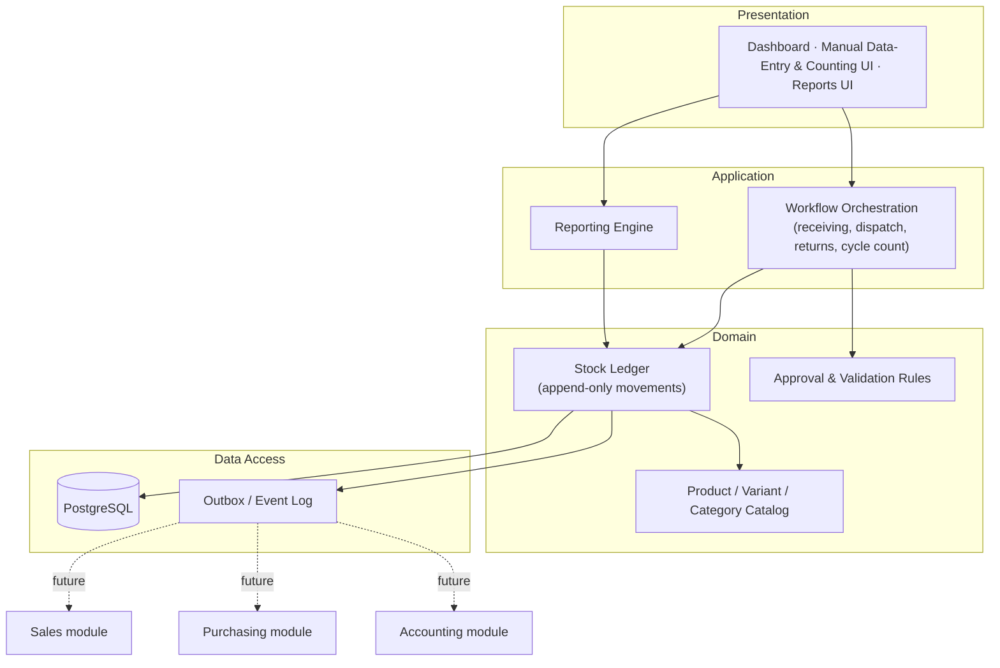
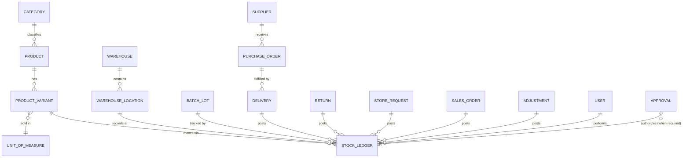
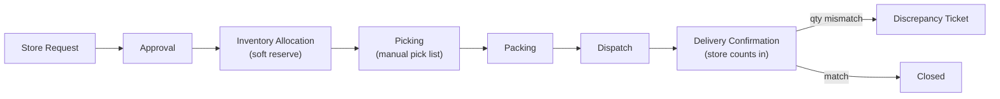
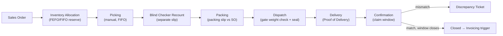
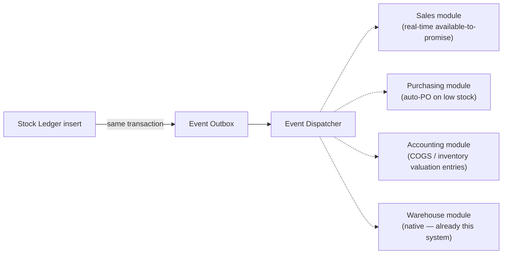

# Inventory Management System — Architecture & Workflow Design

**Status:** Draft for review · **Version:** 0.2 · **Date:** 2026-08-10
**Objective:** Eliminate unexplained inventory loss by making every unit traceable from the moment it enters the warehouse to the moment it leaves.

**v0.2 revision note:** v0.1 assumed barcode/QR scan-to-confirm as the primary verification mechanism at every handoff. The client has since confirmed the warehouse stays fully manual — no scanners, RFID, or automated equipment (see `business-process-design.md`, the governing process document). This revision removes that assumption throughout and replaces it with the BPD's manual controls (blind double counts on independent slips, bound numbered bin cards, gate weight-range checks, tamper-evident seals). It also defers to the BPD for role definitions and step-by-step workflow detail (this document is now scoped to schema, ledger design, and tech stack — not process), and replaces the Phased Rollout in [Section 15](#15-phased-rollout) with the current 5-phase build plan. The ledger design in [Section 5](#5-the-inventory-ledger-the-single-source-of-truth) is schema/scanning-agnostic and is unchanged.

---

## 1. Executive Summary

The client's core business problem is that inventory units go missing without anyone being able to say **when**, **who**, or **which transaction** caused it. Every design decision in this document is subordinate to that objective. The single most important architectural choice is in [Section 5](#5-the-inventory-ledger-the-single-source-of-truth): stock levels are never stored as a number that gets directly edited — they are always the *sum of an immutable history*. Everything else (workflows, dashboard, reports, roles) is built on top of that ledger.

Secondary objectives — dynamic products/categories/variants, a dashboard, exportable reports, and room to plug in Sales/Purchasing/Accounting/Warehouse modules later — are addressed in the sections that follow, but none of them are allowed to compromise the ledger's integrity.

---

## 2. Architecture Overview

A **modular monolith**, not microservices — one system, four internally-separated layers, so a future split into standalone Sales/Purchasing/Accounting services doesn't require a rewrite:



Dependencies point inward only: presentation depends on application, application depends on domain, nothing in the domain layer (the ledger, the catalog, the rules) knows anything about HTTP, React, or PDF generation. This is what lets Sales/Purchasing/Accounting/Warehouse be added later as consumers of the same domain events instead of bolt-ons that reach into the database directly (see [Section 13](#13-future-integration-hooks)).

---

## 3. Core Domain Model

At the center of the schema are five families of tables. Full field-level detail for each is in the sections that follow; this is the map.



Every arrow into `STOCK_LEDGER` is one-directional and append-only — a delivery, return, dispatch, or adjustment *creates* ledger rows; none of them ever edit a row that already exists.

---

## 4. Product, Category, Variant & Unit-of-Measure Design

### 4.1 Dynamic categories
`category` is a self-referencing table (`parent_category_id`) so users can create unlimited categories and subcategories without a developer. Categories are **archived, never hard-deleted** (`archived_at` timestamp) — a category used by historical transactions can't disappear out from under a report.

### 4.2 Products vs. variants

The client's own example — **Tiny**, sold as *Per Sack / Per Ream / Per Piece* — is the standard "one product, many sellable units" problem. The correct structure separates three concerns that are easy to conflate: *what the thing is* (product), *what unit it's counted in physically* (base unit), and *what unit it's sold in* (variant + conversion ratio).

| Table | Purpose | Key fields |
|---|---|---|
| `product` | The conceptual item | `id`, `name`, `description`, `category_id`, `base_unit_id`, `supplier_id` (primary/default), `status` (Active/Archived), `created_by`, `created_at` |
| `unit_of_measure` | Canonical unit list (piece, ream, sack, kg, box…) | `id`, `code`, `name` |
| `product_variant` | A sellable form of a product | `id`, `product_id`, `sku`, `barcode`, `unit_id`, `conversion_to_base` (decimal), `cost`, `selling_price`, `status` |
| `stock_balance` | **Cached, derived** on-hand quantity — always in `base_unit`, never edited directly | `product_id`, `warehouse_location_id`, `batch_id`, `qty_on_hand` |

**Why quantity lives only in the base unit:** if "Per Sack," "Per Ream," and "Per Piece" each kept their own independent stock counter, a sale of one sack and a sale of 40 loose pieces would need two separate manual reconciliations to agree on how much *Tiny* is actually left — that gap is exactly how "missing inventory" complaints start. Instead:

- Every variant declares a `conversion_to_base` (e.g., 1 Sack = 50 kg, 1 Ream = 500 Pieces, 1 Piece = 1 Piece if the base unit is "piece").
- Every stock movement — regardless of which variant was sold or received — is converted to base-unit quantity before it's posted to the ledger.
- `qty_on_hand` and "current stock" always mean *base-unit stock*; the UI converts back to whichever variant a user is looking at (e.g., "held stock" ÷ `conversion_to_base` = sellable reams remaining), including fractional/partial-unit remainders so nothing is silently rounded away.
- Selling a variant that would require *breaking* a larger unit (e.g., selling 3 pieces when only whole sacks are on hand) is a warehouse *unit-conversion* transaction in its own right — a Stock Ledger movement that removes N sacks and adds (N × conversion) pieces — not a silent inference. This keeps the "why did piece-stock suddenly appear" question answerable.

Each variant also keeps its **own** `sku`, `barcode` (kept as an optional reference field, not a workflow dependency), `selling_price`, so retail-store and wholesale pricing work per sellable unit exactly as requested, while inventory truth stays unified underneath.

### 4.3 Recommended additional product fields

Beyond SKU, Name, Description, Category, Unit, Cost, Selling Price, Supplier, Barcode, Status:

| Field | Why |
|---|---|
| `reorder_point` / `reorder_qty` | Drives the Low Stock KPI and future auto-PO trigger to Purchasing |
| `min_stock` / `max_stock` | Enables both **Low Stock** and **Overstock** exception reporting |
| `is_lot_tracked` (bool) | Forces batch/lot capture at receiving for perishables/regulated goods |
| `is_serialized` (bool) | Flags theft-prone/high-value SKUs for unit-level serial tracking; with no scanning hardware, serial capture is a manually-typed field at receiving/dispatch — treat as a post-launch option once basic manual discipline is proven, not a day-one build item |
| `default_warehouse_location_id` | Speeds up putaway suggestions |
| `weight` / `dimensions` | Needed later for shipping/carrier integration |
| `tax_category` | Needed later for Accounting/invoicing integration |
| `image_url` | Warehouse staff visually confirm the right item, reducing pick errors |

---

## 5. The Inventory Ledger — the single source of truth

This is the load-bearing decision in the whole system.

**Rule: no table anywhere stores a stock quantity that application code increments or decrements directly.** Every single unit that enters or leaves the warehouse — supplier delivery, customer return, store dispatch, wholesale dispatch, transfer, scrap, or manual adjustment — creates one row in `stock_ledger`. Current stock is *always* a derived sum, never a stored fact that can silently drift from reality.

```sql
stock_ledger (
  id                  bigint PK,
  product_variant_id  bigint FK,
  warehouse_location_id bigint FK,
  batch_id            bigint FK NULL,
  quantity_delta_base  numeric,      -- + for stock in, − for stock out, always base unit
  movement_type       enum (
    'PO_RECEIPT','CUSTOMER_RETURN','STORE_DISPATCH','WHOLESALE_DISPATCH',
    'TRANSFER_IN','TRANSFER_OUT','ADJUSTMENT_POSITIVE','ADJUSTMENT_NEGATIVE',
    'SCRAP','CYCLE_COUNT_CORRECTION','UNIT_CONVERSION'
  ),
  unit_cost_at_movement numeric,
  reference_type       varchar,      -- 'delivery' | 'return' | 'dispatch' | 'adjustment' | ...
  reference_id         bigint,       -- polymorphic link to the source document
  reason_code          varchar NULL, -- required for ADJUSTMENT_* and SCRAP
  performed_by         uuid FK -> users,
  approved_by          uuid FK -> users NULL,
  reversed_by_ledger_id bigint FK -> stock_ledger NULL,  -- corrections reference, never overwrite
  created_at           timestamptz  -- immutable, never updated
)
```

Consequences of this design, mapped directly to the client's stated needs:

- **Prevents missing inventory:** stock cannot become "wrong" through a UI bug or a forgotten update, because there is no mutable number to forget updating — it's always `SUM(quantity_delta_base)`.
- **Tracks every movement:** by construction — a movement that isn't a ledger row didn't happen, and stock that changed without a ledger row is itself the anomaly a nightly reconciliation job will catch.
- **Fully auditable:** every row carries who (`performed_by`/`approved_by`), what (`movement_type`, `reference_id`), and when (`created_at`, immutable).
- **Corrections never destroy history:** fixing a mistake posts a new reversing row (`reversed_by_ledger_id`) rather than editing or deleting the original — the mistake itself stays visible, which is often exactly what an investigation needs to see.

**Performance:** a `stock_balance` table caches `SUM(quantity_delta_base)` per `(product_variant, location, batch)` so the dashboard and pick lists don't re-aggregate millions of ledger rows on every read. It's updated in the same DB transaction as the ledger insert, and a nightly reconciliation job re-derives it from the ledger and alerts on any mismatch — catching bugs or direct database tampering before they become an unexplained variance months later.

**Negative-stock guard:** the application layer rejects any movement that would drive a computed balance below zero. An explicit, logged, approval-gated "negative stock override" exists for rare legitimate timing issues (e.g., a dispatch that must go out before a delivery is formally posted) — every use of it surfaces on the dashboard, because it's a common way real shortages get hidden until a count finds them.

---

## 6. Stock In Workflows

> **Process authority note:** the field lists and validation rules below describe schema-relevant data capture. For the authoritative, step-by-step operational workflow — including the mandatory blind double count, photo-evidence-at-encoding, and supervisor sign-off sequence — see `business-process-design.md` §7 (Supplier Receiving) and §9 (Customer Returns), as amended by `inventory-fraud-audit.md`.

### 6.1 Supplier Deliveries

**Given fields**, plus recommended additions and why:

| Field | Given / Added | Notes |
|---|---|---|
| Purchase Order (if applicable) | Given | Nullable — supports non-PO/ad-hoc deliveries |
| PO Line reference | **Added** | Needed for partial deliveries against a multi-line PO |
| Supplier | Given | |
| Delivery Date (expected vs. actual) | Given / **Added actual vs. expected** | Feeds the OTIF supplier KPI |
| Delivery Receipt Number | Given | System-generated fallback if supplier doesn't provide one; sequential, gapless |
| Received By | Given | |
| Warehouse Location | Given | Location-level, not just warehouse-level ([Section 12](#12-additional-features-to-reduce-inventory-loss)) |
| Product / Variant | Given | |
| Quantity Ordered / Received / Accepted / Rejected | Given (as "Quantity") / **split into four** | The gap between these four numbers *is* the discrepancy — collapsing them into one field throws away the exact information the client is trying to recover |
| Unit | Given | |
| Batch/Lot (if applicable) | Given | Mandatory when `product.is_lot_tracked` |
| Expiry Date | **Added** | Required with batch/lot for perishables; feeds FEFO picking |
| Cost / Landed Cost | Given / **Added landed cost** | Freight & duties allocated across lines when relevant |
| QC/Inspection Status + Inspector | **Added** | Pass / Partial / Fail, separate from receiving clerk |
| Discrepancy Reason | **Added** | Short-shipped / Damaged / Wrong item — structured, not free text only |
| Photo Attachment | **Added** | Evidence for damage or shortage claims against the supplier |
| Remarks | Given | Free text, supplementary to structured discrepancy reason |

**Status workflow:** `Draft → Received → Inspected → Posted to Stock → Closed`. Stock only posts to the ledger at **Posted**, not at Received — so a delivery that's physically in the building but not yet inspected doesn't count as available stock a store could pick against.

**Validation rules:**
- Cannot post without Product + Quantity + Location + Received By.
- Quantity Received exceeding PO quantity by more than a configurable tolerance requires supervisor approval before posting.
- Lot-tracked categories cannot post without a batch/lot number.
- Zero-cost deliveries are blocked from posting (prevents "phantom value" stock with no cost basis, which breaks valuation reports later).

### 6.2 Returned Items (from customers)

**Given fields**, plus recommended additions:

| Field | Given / Added | Notes |
|---|---|---|
| Original Sales Invoice | Given | Line-level link to the specific SO line, not just the order |
| Return Authorization Number (RMA) | **Added** | Issued *before* physical goods are accepted back — blocks unauthorized walk-in returns from bypassing the process |
| Customer | Given | |
| Return Reason | Given | Structured list (defective, wrong item, changed mind, overshipped…), drives the Return Reason Analysis report |
| Condition of Returned Goods | Given → **graded** | Sellable / Damaged-Repairable / Damaged-Scrap / Expired |
| Quantity | Given | Cannot exceed remaining returnable quantity on the original invoice line |
| Warehouse Destination | Given | Driven by condition grade, see below |
| Inspector | Given | Must differ from the person who authorized the RMA where the return value exceeds a threshold (segregation of duties) |
| Date Returned | Given | |
| Photo Evidence | **Added** | Required when condition = Damaged |
| Refund/Credit Note reference | **Added** | Placeholder link for future Accounting integration |

**Disposition logic (recommended validation rule):** condition grade determines destination automatically, not by clerk judgment call alone —

- **Sellable** → posted back to sellable stock at the warehouse location.
- **Damaged-Repairable** → quarantine location; not sellable until a repair/re-grade transaction moves it out.
- **Damaged-Scrap / Expired** → write-off queue; requires a scrap approval before it leaves inventory value on the books.

**Status workflow:** `Requested → RMA Authorized → Received → Inspected → Disposition → Closed`. Stock is only restored to *sellable* balance at Disposition, never at Received — an unopened-looking box isn't stock until someone has actually looked inside it.

**Validation rules:**
- A return with no matching original invoice/SO is not blocked, but is auto-flagged for manual review — this is a known channel for return fraud.
- Cumulative returned quantity per invoice line cannot exceed originally sold quantity.

---

## 7. Stock Out Workflows

Both channels share one principle: **every handoff between people is independently re-verified by a second, uninvolved person against a physical count — never a re-typed number taken on trust from whoever last touched it.** With no scanners, the equivalent of "scan-to-confirm" is a **blind recount on a separate, independently-numbered slip**: the Checker counts without seeing the Picker's figures, submits directly to the Supervisor, and only a match — or a witnessed, bias-tracked tie-break — clears the release. This is the exact discipline `business-process-design.md` §8 specifies; the diagrams below reflect it. See that document for the full step sequence, including the fraud-audit-driven controls (random independent spot-recount, gate weight-range check, tamper-evident seals).

### 7.1 Retail Store Orders



| Step | Given | Recommended detail |
|---|---|---|
| Store Request | Given | Requesting store, requested by, product/variant + qty, priority, needed-by date |
| Approval | Given | Auto-approve under a configurable value/qty threshold; above it, named approver required |
| **Inventory Allocation** | **Added** | Soft-reserves the requested quantity at approval time so two stores can't both be promised the same last units |
| Picking | Given | System-generated pick list, hand-counted against it; picked-vs-requested variance logged per line |
| Packing | Given | Carton count, weight, tamper-seal number recorded |
| Dispatch | Given | Vehicle/driver, dispatch timestamp, system-generated Stock Transfer Note (sequential, gapless numbering) |
| Delivery Confirmation | Given | Receiving store hand-counts items in; confirmed qty vs. dispatched qty compared automatically |

Any mismatch at Picking, Dispatch, or Delivery Confirmation auto-opens a **Discrepancy Ticket** tied to the specific step and the specific person who counted it — this is the mechanism that answers "which transaction caused it."

### 7.2 Wholesale Orders



| Step | Given | Recommended detail |
|---|---|---|
| Sales Order | Given | Customer, SO number, order date, requested delivery date, payment terms (future Accounting hook), sales rep |
| Inventory Allocation | Given | Reserved at SO confirmation; lot-tracked stock allocated FEFO (First-Expired-First-Out) by default |
| Picking | Given | Manual pick list, FIFO order |
| Blind Checker Recount | **Added** | Independent recount against the order (not against the Picker's figures) on a separate slip, submitted straight to the Supervisor |
| Packing | Given | Packing slip auto-matched line-by-line against the checked (not ordered) quantity |
| Dispatch | Given | Waybill/DR number, carrier, tracking number, gate weight-range check against expected load weight, tamper-evident numbered seal |
| Delivery | Given | Proof of Delivery — signature or photo; partial deliveries recorded per line, not just per order |
| Confirmation | Given | Customer sign-off; a defined discrepancy-claim window (e.g. 48 hours) after which the delivery record locks and cannot be disputed retroactively — kept separate from the internal 24-hour POD-return SLA |

Confirmed delivery is the trigger point for a future Accounting integration (invoice generation) — the ledger doesn't need to know about invoicing, it just needs to emit the event ([Section 13](#13-future-integration-hooks)).

---

## 8. Roles, Approvals & Segregation of Duties

> **Superseded by `business-process-design.md` §4.** That document defines the authoritative, more granular role set (Owner/GM, Branch Manager, Warehouse Supervisor, Receiver, Picker, Checker, Encoder, Cashier, Sales Rep, Auditor, Security Guard, System Administrator), the full permission matrix, the four irreducible separations (Custody≠Recording, Requesting≠Approving, Picking≠Checking, Operations≠Audit), and the small-branch compensating controls. RBAC implementation should map directly to that role set, not the simplified table previously here.

**Core rule (maker–checker):** the person who records a stock adjustment, scrap, or negative-stock override is never the person who approves it. This single rule closes the most common inventory-loss channel — one person with unilateral power to both create and justify a "correction." (Formalized as SoD-2 in the BPD.)

---

## 9. Audit Trail & Missing-Inventory Investigation Design

Mapped directly to the client's primary objective:

| Client question | Answered by |
|---|---|
| When did the discrepancy happen? | `stock_ledger.created_at` (immutable) brackets the window; cycle count timestamps narrow it further |
| Who performed the transaction? | `performed_by` / `approved_by` on every ledger row |
| Which transaction caused it? | `reference_type` + `reference_id` links every ledger row to its source document (delivery, dispatch, adjustment, cycle count) |
| Expected quantity vs. actual quantity | Captured at every handoff: pick-list expected vs. blind-counted, dispatched vs. delivered, and system balance vs. physical cycle count |
| Adjustment history | `adjustment` table — append-only, each row linked 1:1 to the ledger row it created |
| Approval history | `approval` table — requested_by, approved_by/rejected_by, timestamp, comment, linked to the action it authorized |
| Audit trail | The ledger *is* the audit trail for stock; a separate generic `audit_log` covers non-stock actions (master data edits, price changes, permission changes) |

**Recommended addition — Discrepancy Case:** when a cycle count or delivery variance exceeds tolerance, the system opens a formal case bundling expected qty, actual qty, variance value, every ledger entry in the affected window, an assigned investigator, and a required resolution (write-off / correction / recovered) before any financial impact is booked. This turns "inventory went missing" from a one-line adjustment into a tracked, closeable investigation with its own history.

---

## 10. Inventory Summary Dashboard

**Requested KPIs** — all included as specified: Total Inventory Value, Total Products, Total Stock On Hand, Low Stock Items, Out of Stock Items, Returned Items, Stock In Today, Stock Out Today, Fast Moving Products, Slow Moving Products, Most Returned Products.

**Recommended additions**, prioritized by relevance to the stated shrinkage problem:

| KPI | Why it matters here |
|---|---|
| **Shrinkage / Variance Rate (%)** | Directly tracks the client's core pain point period over period — the single most important new number on this dashboard |
| **Open Discrepancy Cases** (count + value at risk) | Shows unresolved investigations before they age into write-offs |
| **Negative-Stock Override count** | Should sit at ~0; any nonzero value is a red flag worth surfacing prominently |
| **Cycle Count Accuracy %** | Leading indicator — degrading accuracy predicts future "missing inventory" reports |
| **Top Discrepancy Locations** | Pinpoints *where* loss concentrates (which warehouse or bin), narrowing investigation scope |
| Inventory Turnover Ratio / Days on Hand | Standard warehouse-management KPIs stakeholders will expect |
| Dead Stock Value (no movement in N days) | Capital tied up, distinct from "slow moving" |
| Pending Approvals | Surfaces bottlenecks in the approval-gated workflows |
| Supplier OTIF Rate | Separates supplier short-shipment from warehouse-side loss — an important root-cause split |
| Avg. Dispatch Cycle Time | Operational efficiency, useful once loss-prevention controls are in place |

---

## 11. Inventory Reports

**Exports:** CSV, Excel, and PDF as requested (Excel and PDF generated server-side; large exports run through a background job queue rather than blocking the request). **Periods:** Daily, Weekly, Monthly, Custom range — all as requested.

**Exception highlighting**, all requested items included: Missing inventory, Discrepancies, Negative stock, Unusual stock movements, Low stock, Overstock, Items without movement, Returned items.

**Recommended additional reports**, each aimed at the auditability objective:

| Report | Purpose |
|---|---|
| **Full Stock Ledger / Movement History** | The master audit report — every movement, filterable by product, location, user, date, or movement type. This is the report an external auditor or the client will ask for first. |
| **Adjustment Report** | Every manual adjustment, by user, with approval status — surfaces a specific individual repeatedly "correcting" stock before it becomes a pattern |
| **Cycle Count Variance Report** | Expected vs. counted, by counter and location, flagging repeat-offender locations |
| **Reconciliation Report** | Ledger-derived balance vs. physical count, variance %, by location — the report that proves the ledger and reality agree |
| **Return Reason Analysis** | Top return reasons by product/customer — root-causes return-driven loss instead of just logging it |
| **Batch/Lot Expiry Report** | Upcoming expirations and FEFO compliance |
| **Supplier Performance / OTIF Report** | Short-shipment and damage rate by supplier — separates supplier-side loss from warehouse-side loss |
| **User Activity Report** | Volume and type of transactions per user — anomaly detection input |
| **Valuation Report** | Weighted-average cost valuation, structured for future Accounting reconciliation |

---

## 12. Additional Features to Reduce Inventory Loss

Ranked by expected impact on the client's stated problem. This ranking is superseded in priority order by `inventory-fraud-audit.md` §16's "Top 10 changes ranked by leverage," which was produced by adversarially testing the process design rather than ranking generically — treat that list as authoritative for sequencing; the items below remain valid as a feature inventory.

1. **Blind independent recount on a separate, numbered slip at every handoff** — receiving, picking/checking, cycle count. The manual equivalent of scan-to-confirm: removes the single largest source of untraceable variance (one person's uncorroborated count) without requiring scanning hardware.
2. **Append-only, hash-chained ledger with derived balances** ([Section 5](#5-the-inventory-ledger-the-single-source-of-truth)) — makes tampering or bugs *detectable*, not just harder.
3. **Maker–checker on all adjustments and write-offs** above a configurable threshold ([Section 8](#8-roles-approvals--segregation-of-duties)), with approval routed on the requester's rolling cumulative value, not per-transaction.
4. **ABC-classified cycle counts** — high-value/fast-moving items counted more often than low-value slow movers; variance beyond tolerance auto-opens a Discrepancy Case; count compliance itself is monitored as a KPI.
5. **Photo/video evidence** at receiving (source document + damage claims), returns (condition grading), and disposal (proof of actual destruction).
6. **Bin/location-level tracking** via bound, pre-numbered physical bin cards with daily photographic capture — "missing from Bin A-14" is investigable; "missing from Warehouse 1" is not.
7. **Hard block on negative stock**, real-time pre-transaction Owner approval only, no retroactive override path — stops dispatches from silently drawing down stock that was never actually received.
8. *(Post-launch option, once manual discipline is proven — not a Phase 1 investment)* Serialized tracking for theft-prone/high-value SKUs, layered on top of batch/lot tracking for perishables; would require scanning hardware to be worthwhile at scale.
9. **Real-time low-stock/zero-stock alerts** — prevents a genuine stockout from being misreported as "missing" inventory.
10. **Supplier scorecards** (short-shipment rate, damage rate) — much reported "missing" stock at receiving is actually supplier short-shipment, a different root cause than warehouse theft.
11. **Gate weight-range check + tamper-evident numbered seals** on top of package-count verification at every exit — closes the gap a count-only gate check leaves open.
12. **Sequential, gapless document numbering** (DR numbers, RMAs, dispatch notes) enforced as a hard database constraint, plus a central booklet registry so pre-numbered paper forms can't be sourced outside the system.
13. **Nightly reconciliation job** comparing the ledger's derived total against the cached balance table, alerting on any mismatch; daily reconciliation independently re-verified by someone who didn't create that day's records.
14. **Least-privilege, role-based access** with idle-timeout re-authentication before every posting — pickers can't touch cost fields; only authorized roles can post adjustments; ledger exports are restricted and logged.
15. *(Later-stage, optional)* RFID or shelf weight-sensors for the highest-shrinkage categories, once manual-count discipline is already mature and six months of clean data exists — explicitly not a near-term investment per the client's confirmed manual-warehouse decision.

---

## 13. Future Integration Hooks

Every ledger insert writes a row to an `event_outbox` table in the same DB transaction (the outbox pattern — guarantees the event is never lost or double-fired independent of the ledger write):



All future modules integrate through this event stream and versioned internal APIs (`/api/v1/...`), never through direct database access — each module owns its own data, per the standard service-oriented boundary. This means Sales, Purchasing, and Accounting can be built later without touching the ledger's schema or logic.

---

## 14. Recommended Tech Stack

| Layer | Choice | Why |
|---|---|---|
| Frontend | Next.js (App Router) + TypeScript + Tailwind + shadcn/ui | Org default; dashboard + forms fit the App Router model well |
| Backend | Next.js API routes, or Fastify/Nest if split out later | Start monolithic, split only when a real scaling reason appears |
| Database | PostgreSQL | Transactional integrity for the ledger is non-negotiable |
| ORM | Prisma | Versioned migrations; no hand-edited prod schema |
| Evidence capture | Mobile-web camera capture (photo/short video) attached directly to receiving, count-slip, return-grading, and disposal records; no barcode/QR scanning — the warehouse is confirmed fully manual | Runs in any phone browser via a PWA, no native app or scanning hardware required |
| Reports | `exceljs` (Excel), headless PDF render (e.g. Puppeteer/React-PDF), native streaming CSV | Server-side generation, queued for large exports |
| Auth | Clerk / Auth.js, role-based access control | Never hand-roll session/credential handling |
| Queue | Redis + BullMQ | Report generation, nightly reconciliation job |
| Observability | Sentry + structured logs with correlation IDs on every ledger movement | Every movement traceable end to end, including in application logs |

---

## 15. Phased Rollout

> **Superseded.** The 3-phase table previously here (MVP / Phase 2 / Phase 3) predates the fraud audit and the manual-warehouse decision, and no longer reflects how the build is sequenced. The current, authoritative build plan is 5 phases, sequenced specifically to front-load the highest-leverage anti-fraud controls (the ledger, receiving hardening, and stock-out hardening land in Phases 1–2, before cycle counts/reconciliation/multi-branch in Phase 4 and UAT/parallel-run/cutover in Phase 5). See the project's current build plan for the full phase breakdown, the fraud-audit-finding-to-phase mapping (all 35 findings), and phase-by-phase acceptance criteria.

---

## Open Questions for the Client

> **Superseded by the consolidated decision list.** The four questions previously here are a subset of the fuller list already tracked in `business-process-design.md` Appendix E (12 open questions) and distilled for the client in `executive-summary.html` as the "six decisions we need from you" (Auditor identity, approval peso-thresholds, one stock pool vs. two, delivery dispute-window length, which products get weekly vs. monthly cycle counts, and branch count/timing). Answering those six resolves this section's four questions as a subset — question 2 (FEFO scope) is the one item not already covered and should be confirmed alongside the six.
