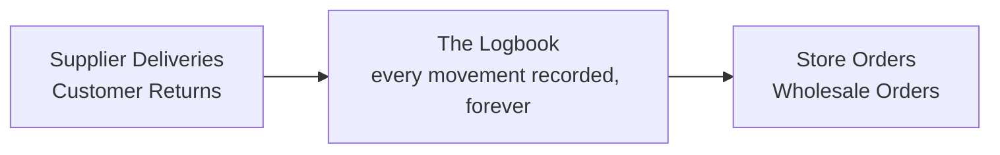
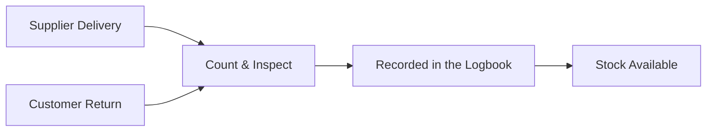
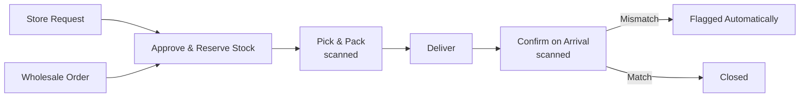

# Inventory Control Plan

**A simple, foolproof process for tracking every item from the moment it arrives to the moment it's sold.**
Version 1.0 · 2026-07-27 · Plain-English edition for business review

---

## 1. The Goal

Right now, stock sometimes goes missing and nobody can say **when** it happened, **who** was involved, or **what transaction** caused it.

This plan is built around one non-negotiable rule: **every single item that enters or leaves the warehouse must be written down at the exact moment it happens, in a way nobody can quietly erase.**

If that one rule holds without exception, stock cannot go missing without leaving a trace. This doesn't mean theft or mistakes become impossible — it means nothing can disappear *silently*. Every item is always accounted for, and any gap points straight to an exact moment, item, and person.

---

## 2. The Big Picture

Everything that happens to stock — coming in or going out — passes through one shared logbook. Nothing enters or leaves the warehouse without a record being created first.

---

## 3. The Three Rules That Guarantee Nothing Goes Missing

**Rule 1 — Nothing moves without a scan or a written record.**
Every item in or out gets scanned or logged at the exact moment it moves — not remembered and typed in later. If it wasn't scanned, it didn't officially happen, and stock won't update.

**Rule 2 — The record can be corrected, but never erased.**
If a mistake is found, the fix is added as a new note alongside the original — the original never disappears. Nobody can quietly edit history, so you can always see exactly what changed, when, and why.

**Rule 3 — No one person can make an adjustment and approve it themselves.**
Any manual stock correction or write-off needs a second person to sign off before it counts. One person acting alone can never make inventory quietly "disappear" through an adjustment.

**Built-in safety net:** the system never lets stock go below zero. If someone tries to remove more than what's on record, it's blocked and sent to a manager — instead of silently going negative, which is exactly how shortages hide for months before anyone notices.

> **Why this equals zero loss:** because every movement is scanned (Rule 1), permanently recorded (Rule 2), and every adjustment needs two people (Rule 3), there is no path for stock to vanish without a record pointing to the exact moment and person responsible. Even in a worst case — theft or damage — you'll know it happened, when, and where, immediately, instead of discovering it months later during a count.

---

## 4. Products & Pack Sizes

One product can be sold in more than one size. Using the client's own example — **Tiny**, sold Per Sack, Per Ream, and Per Piece:

| Sold as | Equivalent in base units |
|---|---|
| Per Sack | 50 kg |
| Per Ream | 500 pieces |
| Per Piece | 1 piece |

Whichever size someone buys, the system converts it back to the same shared count — so a sack sold and 40 loose pieces sold both come out of the same total, instead of being tracked separately and needing manual reconciliation to agree on what's really left.

**Categories:** users can create, rename, and archive as many product categories as needed, no developer required. Archived categories stay out of the way for new use, but old records stay intact.

---

## 5. Stock In — How Items Enter the Warehouse

There are two ways items come into the warehouse:

### A. Supplier Deliveries
1. Delivery arrives and is checked against the order, if there was one.
2. Warehouse staff count and inspect it, noting any damage or shortage.
3. The delivery is recorded in the logbook — supplier, date, who received it, where it's stored, and cost.
4. Stock becomes available right after it's recorded — not before.

**What gets written down every time:** what was ordered (if applicable) · who delivered it and when · who received and checked it · where it was stored · what arrived vs. what was expected, including any shortage or damage · cost.

### B. Customer Returns
1. The customer's return request is approved *before* the item is physically accepted back.
2. The returned item is inspected: sellable, damaged, or expired.
3. The return is recorded, referencing the original sale it belongs to.
4. If sellable, stock goes back to available. If damaged or expired, it's set aside separately — not sellable — until a manager decides what happens to it.

---

## 6. Stock Out — How Items Leave the Warehouse

There are two sales channels, both following the same safe process:

1. **Order placed and approved** — a store request or a wholesale sales order. Stock is reserved right away so nobody else can be promised the same units.
2. **Picked and packed** — every item is scanned as it's pulled, so what's picked always matches what was ordered.
3. **Delivered** to the store or customer.
4. **Confirmed on arrival** — the receiver scans or checks the items; any mismatch is flagged automatically, tied to the exact step and person where it happened.

---

## 7. Who Can Do What

| Role | Can do | Can't do |
|---|---|---|
| Warehouse Staff | Receive, pick, pack, scan deliveries and orders | Change stock numbers directly, or approve their own corrections |
| Supervisor / Manager | Approve requests and sign off on adjustments | Approve an adjustment they made themselves |
| Admin | Manage products, categories, and user access | Bypass the logbook — nobody can |

---

## 8. Finding a Missing Item

| Question | How the system answers it |
|---|---|
| When did it happen? | The record shows the exact date and time it occurred |
| Who did it? | Every record shows who performed it, and who approved it if it was an adjustment |
| What caused it? | Every record links back to the exact delivery, order, return, or adjustment that created it |
| Expected vs. actual? | Captured every time stock is picked, delivered, or counted |
| History of corrections | Every past adjustment stays visible — never erased |

---

## 9. The Dashboard — What Managers See at a Glance

- Total Inventory Value
- Total Products
- Total Stock On Hand
- Low Stock Items
- Out of Stock Items
- Returned Items
- Stock In Today / Stock Out Today
- Fast Moving / Slow Moving Products
- Most Returned Products

**Recommended additions, most important first:**
- **Shrinkage Rate (%)** — tracks the core problem this whole plan is built to fix, period over period
- **Open Discrepancy Cases** — unresolved investigations, before they age into write-offs
- **Blocked Negative-Stock Attempts** — should sit near zero; any spike is a red flag
- **Count Accuracy %** — an early warning sign before losses show up elsewhere
- **Locations With the Most Discrepancies** — shows exactly where problems are concentrated

---

## 10. Reports You Can Download

Downloadable as CSV, Excel, or PDF. Runs Daily, Weekly, Monthly, or a Custom date range.

**Automatically flags:** missing inventory, discrepancies, negative stock, unusual movements, low stock, overstock, items with no movement, and returns.

**Recommended additional reports:**
- **Full Movement History** — every single stock movement, searchable by product, location, person, date, or type — the first thing anyone auditing the business will ask for
- **Adjustment Report** — every manual correction, by person, with approval status — catches a repeat pattern before it becomes a habit
- **Count Variance Report** — expected vs. actually counted, by location
- **Return Reason Report** — top reasons items come back, by product and customer
- **Supplier Performance Report** — separates supplier short-shipments from warehouse-side loss

---

## 11. Extra Safeguards Worth Adding

1. Scan everything, every time — never type in a quantity from memory.
2. Run regular spot-checks on stock, more often for high-value or fast-moving items, and investigate any difference immediately.
3. Take a photo when receiving damaged goods or accepting a return.
4. Track exactly which shelf or bin stock sits in, not just which warehouse.
5. Never let stock go negative.
6. Track expensive or theft-prone items individually, not just by batch.
7. Send an instant alert the moment stock runs low or hits zero.
8. Track supplier performance, so a short delivery is caught immediately instead of being mistaken for warehouse loss later.
9. Use a scanning app on the warehouse floor instead of writing on paper and typing it in later.
10. Give every document — receipts, delivery notes, returns — a unique number issued in order, so none can be skipped or reused to hide something.
11. Limit who can see or download the full stock records, and keep a log of every time someone does.

---

## 12. Rollout Plan

| Phase | What's included |
|---|---|
| **1 — Core** | The logbook, supplier receiving, both order types, the two-person approval rule, and a basic dashboard |
| **2 — Complete** | Customer returns, scheduled stock counts, downloadable reports, and a scanning app for the floor |
| **3 — Connected** | Linking to Sales, Purchasing, and Accounting once those are ready, plus supplier scorecards and item-level tracking for high-value goods |

---

## Questions for You

1. Do Retail Stores and Wholesale customers draw from the **same** stock, or should stock be set aside separately for each?
2. Should returns always use oldest-first stock rotation, or only for specific product types?
3. At what value or quantity should a stock correction require manager sign-off?
4. How long should a customer have to report a delivery problem before it's considered final?
